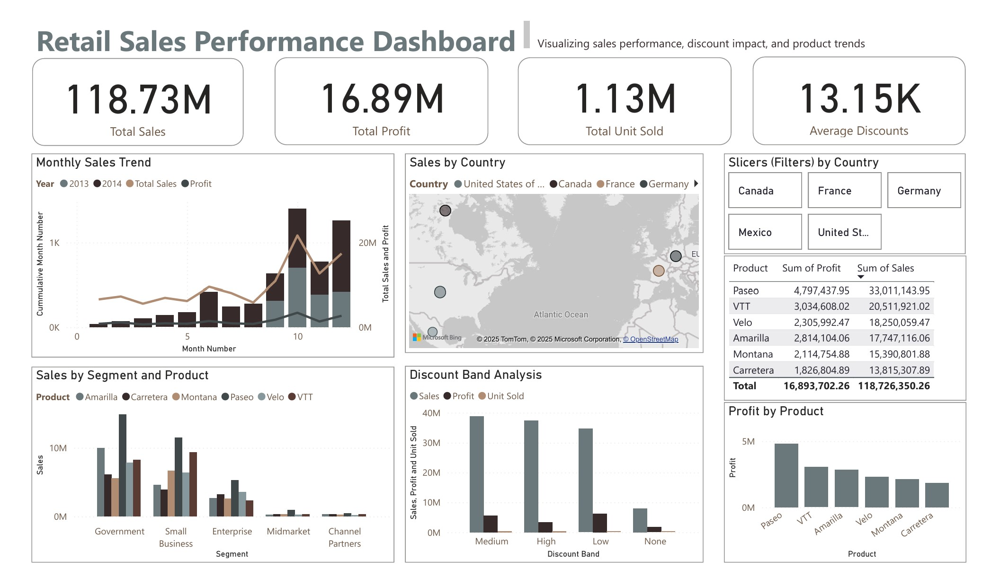

# 📊 Data Analyst Projects

Welcome to data analyst Projects! This repository shows three diverse and practical projects with:

- Data visualization (Power BI / Tableau)
- Exploratory data analysis (Python, SQL)
- Predictive modeling (Python & R)

Each project includes real-world datasets and is focused on business impact, clarity, and technical depth.

---

## 🛍️ 1. Retail Sales Dashboard (Power BI)

**📁 Folder:** `retail-sales-dashboard`  
**Dataset:** [Sample Superstore Dataset (Tableau)](https://community.tableau.com/s/sample-superstore)

### 🔍 Project Summary
This interactive dashboard helps visualize sales performance across regions, categories, and customer segments. Users can analyze profit trends, apply dynamic filters, and assess KPIs to guide business decisions.

### 🧰 Skills & Tools
- Data cleaning and aggregation
- DAX measures or calculated fields
- Slicers, filters, and visual storytelling
- Power BI or Tableau dashboards

📸 Dashboard snapshot

---

## 🏠 23. Housing Price Prediction (Python or R)

**📁 Folder:** `housing-price-prediction`  
**Dataset:** [Kaggle: House Prices - Advanced Regression](https://www.kaggle.com/c/house-prices-advanced-regression-techniques)

### 🔍 Project Summary
This machine learning model predicts housing sale prices using regression models. It includes Ridge, Lasso, and optionally XGBoost or Random Forest.

### 🧰 Skills & Tools
- Python (or R) for regression modeling
- Data preprocessing & dummy encoding
- Feature importance visualization
- Model tuning with GridSearchCV
- Evaluation using RMSE

---

## 📈 3. COVID-19 Global Trends Analysis (Python + SQL)

**📁 Folder:** `covid19-global-trends`  
**Dataset:** [Our World in Data - COVID-19](https://ourworldindata.org/coronavirus)

### 🔍 Project Summary
This project explores COVID-19 case trends, vaccination progress, and death rates across countries and continents. It uses Python for wrangling, SQL for queries, and Seaborn for visual storytelling.

### 🧰 Skills & Tools
- Pandas, Matplotlib, Seaborn
- SQLite for relational analysis
- Data cleaning, joins, and aggregation
- Jupyter Notebook visualizations
- Feature correlation & pie/line/bar charts

---

## 🧠 Highlights

- Real-world datasets with business relevance  
- Code-first approach with Python, SQL, and R  
- Visual-first approach using Tableau / Power BI  
- Each folder includes a standalone `README.md`, Jupyter/R notebook, and data instructions

---

