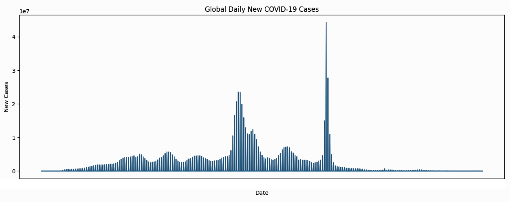
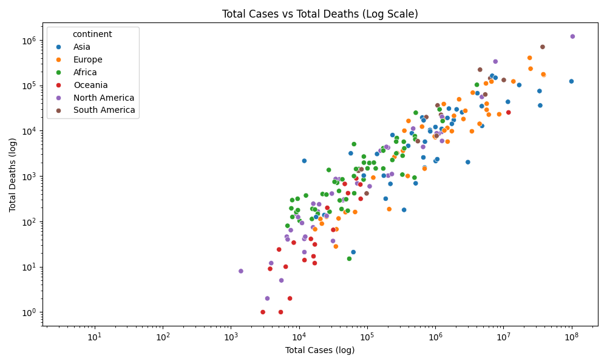
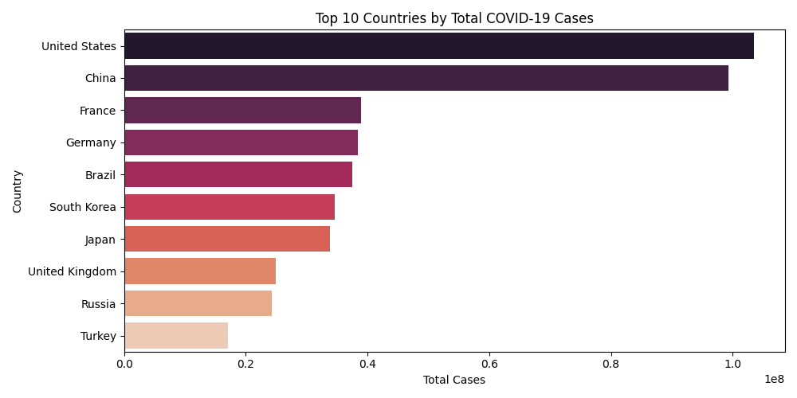
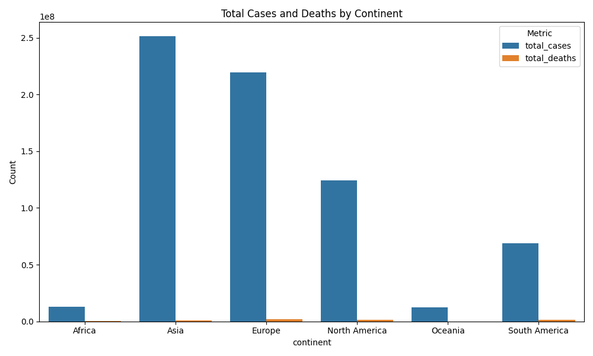

### 🌍 Project Title

**COVID-19 Global Trends Analysis**

### 📊 Overview

This project analyzes global COVID-19 data from *Our World in Data*, covering:

* Case and death trends
* Vaccination rates
* Country-level comparisons
* Correlation with GDP
* Visualization dashboards

---

### 🧰 Tools & Technologies

* **Python**: Pandas, Matplotlib, Seaborn
* **SQLite**: for local database storage
* **Jupyter Notebook / VS Code**
* **Git & GitHub**

---

### 📁 Dataset

* [Our World in Data: COVID-19](https://ourworldindata.org/covid-cases)
* GDP data: [World Bank](https://data.worldbank.org/indicator/NY.GDP.PCAP.CD)

> ⚠️ **Note:** Large files (`cleaned_covid_data.csv`, `covid.db`) 
---

📈 Key Visualizations

1. **Global Daily New Cases** (Line Chart)
2. **Total Cases vs Total Deaths** (Scatter, Log Scale)
3. **Death Rate vs Vaccination Rate**
4. **Top 10 Countries by Total Cases**
5. **Vaccinations per 100 People** (Multi-Country Line)
6. **Cases & Deaths by Continent** (Grouped Bar)
7. **Vaccination Share by Country** (Pie Chart)
8. **Correlation Heatmap**: GDP vs Vaccination, Cases, Deaths

---

🛠️ Setup Instructions

```bash
# Install dependencies
pip install pandas matplotlib seaborn

# Optional: Create SQLite DB
python covid_analysis.py
```

---

🧪 Sample Output






---

📂 Folder Structure

```
📦 covid-analysis/
├── cleaned_covid_data.csv   
├── covid_analysis.py
├── gdp_per_capita.csv
├── README.md
├── images
│   └── Figure_0.png
│   └── Figure_1.png
│   └── Figure_2.png
│   └── Figure_3.png
│   └── Figure_4.png
│   └── Figure_5.png
│   └── Figure_6.png
```


